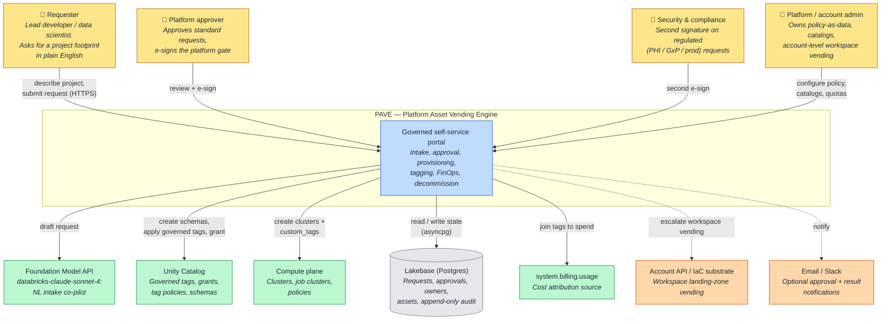

# 1. System Context (C4 Level 1)

The highest-level view: **PAVE** as a single black box, the people who use it, and the external
systems it depends on. Use this to explain "what is this thing and what does it touch" to anyone,
including non-engineers.

## How to read it

- Everything inside the **PAVE** box is one deployable: a Databricks App. Users never touch the SDK,
  the provisioner, or Postgres directly — only the portal UI.
- The **requester** describes what they need; the **co-pilot** (Foundation Model API) turns plain
  English into a structured, tagged request. Approvers and compliance sign at gates that depend on
  the request's risk (see [05](05-risk-tiered-routing.md)).
- The dependency that matters most is **Unity Catalog** — that's where governed tags, grants, and
  schemas are actually created, and where the tag vocabulary joins back to **`system.billing.usage`**
  for cost attribution ([06](06-governance-tagging-finops.md)).

## Key points

- **Governance at birth.** Tags, owner, classification, and audit are attached at creation, not
  bolted on later. There is no "ungoverned" state a resource can exist in.
- **Account-level vending** (new workspaces) is an escalation path, not the common case — it hands
  off to the Account API (real serverless create) under a stricter gate, and emits Terraform for the
  classic path.
- **Multi-workspace targeting** — a request can name a `target_workspace`; PAVE provisions into that
  workspace (or the app's own) via a per-host SDK client, so it is not limited to the workspace it
  runs in.
- **Approval-request email** with a deep-link back to the approval is a built, wired feature (SMTP
  when configured, otherwise simulated + audited). The default record of every action remains the
  append-only audit log in Lakebase; Slack is not implemented.
