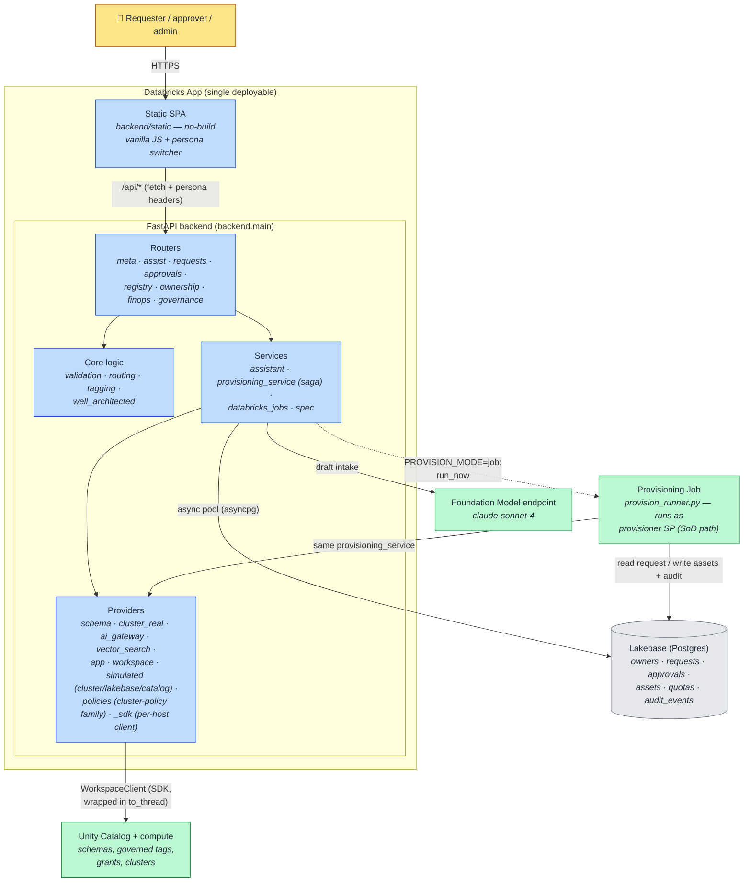

# 2. Container (C4 Level 2)

Zoom into the **PAVE** box: the major runtime pieces, where each process runs, and how they talk.
"Container" here means an independently running/deployable thing, not a Docker container.

## How to read it

- **SPA → FastAPI → services → providers** is the whole request path. Routers stay thin (validate,
  call a service, return JSON); business logic lives in `core` and `services`; only **providers**
  touch the Databricks SDK.
- The **provisioning saga** (`provisioning_service`) is the one engine. It runs **in-process** in
  the backend for the demo (`PROVISION_MODE=inprocess`) or is handed to the **provisioning Job**
  (`PROVISION_MODE=job`) for separation of duties — *the same code either way* ([07](07-identity-sod.md)).
- The **Databricks SDK is synchronous**, so every provider call is wrapped in `asyncio.to_thread`
  to keep the async backend responsive.

## Key points

- **No build step on the frontend.** The SPA is hand-written static assets served by the same
  FastAPI process — one deployable, no Node toolchain.
- **Lakebase is the desired-state store.** It holds operational state and the append-only audit; it
  is what replaces per-request Terraform/DABs state files ([08](08-data-model.md)).
- **Providers are pluggable per resource type**, and each has a real and a simulated mode
  ([09](09-hybrid-provisioning.md)).
