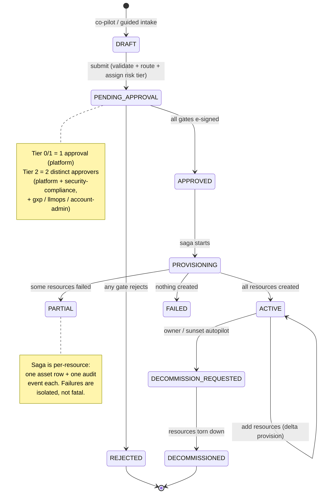

# 3. Request Lifecycle (State Machine)

Every request is a small state machine. This view is the contract for what can happen to a request
and when — and every transition writes an append-only audit event, so the state history is the
compliance record.

## How to read it

- **Every request goes to `PENDING_APPROVAL`.** On submit, PAVE validates, routes to a risk tier,
  and persists the request as `PENDING_APPROVAL` — there is no auto-approve. A **Tier-0** request
  (dev sandbox, low cost, non-sensitive) still needs **one** e-signed platform approval; it's the
  *fast lane* only in that it requires a single approval, not dual ([05](05-risk-tiered-routing.md)).
- **`PARTIAL` is a first-class state, not an error.** The saga provisions each resource
  independently; if one fails, the others still land and the request is `PARTIAL` with a precise
  record of what succeeded ([04](04-provisioning-saga.md)). (There is no automatic retry today;
  assets upsert by id, so a re-run is idempotent.)
- **Add-to-existing** — an `ACTIVE` project can gain new resources via `POST /api/requests/{id}/resources`
  (approver + e-sign); only the new resources are provisioned (a delta), and the request stays `ACTIVE`.
- **Decommission is governed too** — either an owner requests it or the sunset autopilot flags it
  ([10](10-reconcile-drift.md)); it is not a silent delete.

## Key points

- Every arrow = one `audit_events` row with `from_state`, `to_state`, `actor`, and `ts`. The audit
  table is **append-only** (ALCOA+): never updated or deleted.
- The tiers map to ITIL change types: **Tier-0 = Standard Change** (single pre-authorized approval),
  **Tier 1/2 = Normal Change** (CAB-equivalent approval; Tier 2 needs two distinct approvers).
