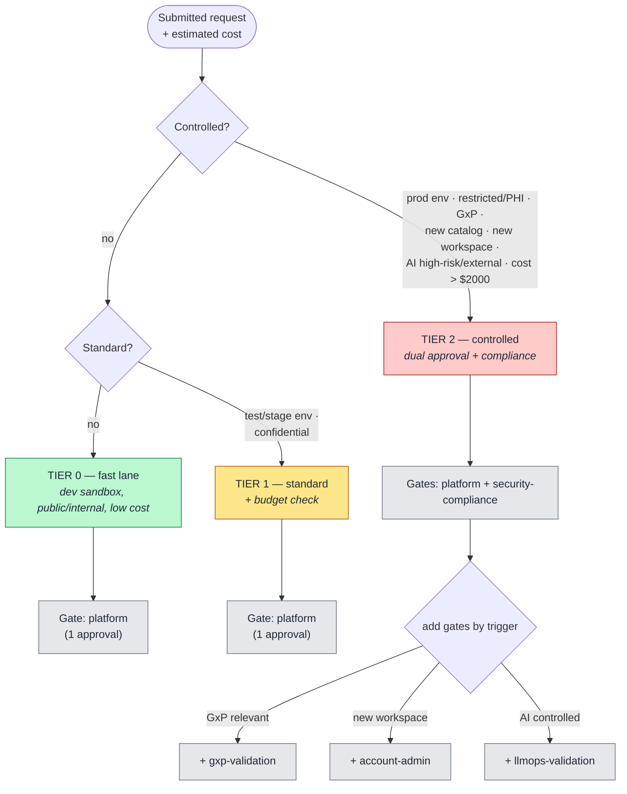

# 5. Risk-Tiered Routing (Decision Flow)

How a request is scored into a **risk tier** and which **approval gates** it must pass. The rules
are **policy-as-data** (`routing.py`) — declarative, auditable, and tweakable without touching
handler code. This is where "guardrails, not gatekeeping" is enforced.

## How to read it

- Routing evaluates a request top-down and returns a `RoutingDecision` (tier + ordered gates +
  human-readable rationale). The rationale is stored so an auditor sees *why* a request was tiered
  the way it was.
- **Tier 0 is the golden path.** Dev, non-sensitive, low cost → a **single** platform approval (no
  dual approval, no compliance gate). It is not auto-approved — every request needs at least one
  e-signed approval — but the single-approval fast lane is the "days into minutes" win.
- **Tier 2 accumulates gates by trigger.** A prod PHI GxP request that spins up an AI endpoint could
  require platform + security-compliance + gxp-validation + llmops-validation, in order. Each gate
  is a distinct signature.
- The **cost escalation threshold** ($2000 estimated monthly, configurable) can pull an otherwise
  low-tier request up to controlled — FinOps guardrail, not just a security one.

## Key points

- **Policy as data.** Tiers and gates are declarative rules, not `if`s scattered through routers, so
  the governance model is one file a compliance team can read and change.
- **Mandatory tags are enforced at provisioning time** (in `tagging`/the WAF+saga path), the only
  reliable place — tag policies alone cannot guarantee presence at creation. (Routing itself scores
  the tier; it does not check tags.)
- Maps cleanly to **ITIL**: Tier-0 = Standard Change (single pre-authorized approval), Tier 1/2 =
  Normal Change.
