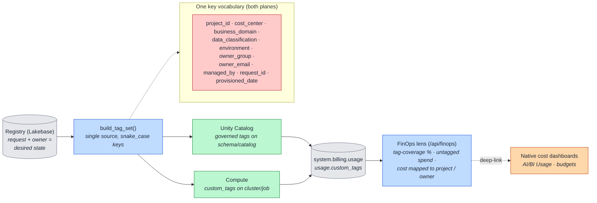

# 6. Governance, Tagging & FinOps (Data Flow)

How **one logical tag set**, derived from the registry, flows onto both governance planes and lands
as **cost attribution** in the billing system. This is what makes spend traceable to a project and
owner — the "attribution completeness" story.

## How to read it

- **The registry is the source of truth.** `build_tag_set()` reads the request + owner and produces
  the tag dictionary once. That same dictionary is applied as **UC governed tags** (data plane) and
  **compute `custom_tags`** (compute plane) — identical keys, so nothing drifts between planes.
- Because both planes carry the **same keys**, `system.billing.usage.custom_tags` joins cleanly on
  `project_id` / `cost_center` / `business_domain`. Spend becomes attributable without any manual
  mapping.
- PAVE's FinOps surface is **attribution completeness** (how much spend is correctly tagged, what is
  untagged, which project/owner owns it) — it **complements** Databricks' native cost reporting and
  deep-links to it, rather than rebuilding cost charts.

## Key points

- **Tags follow the owner.** Ownership reassignment re-runs `build_tag_set()` with the new owner, so
  `owner_email` / `owner_group` / `cost_center` re-derive automatically — no stale attribution.
- **Rules:** lowercase snake_case keys; no PII or secrets in tags; never emit a `Name` key.
- `managed_by = self-service-portal` marks every PAVE-provisioned asset, so a sweep can instantly
  tell PAVE-governed resources from hand-created ones ([10](10-reconcile-drift.md)).
