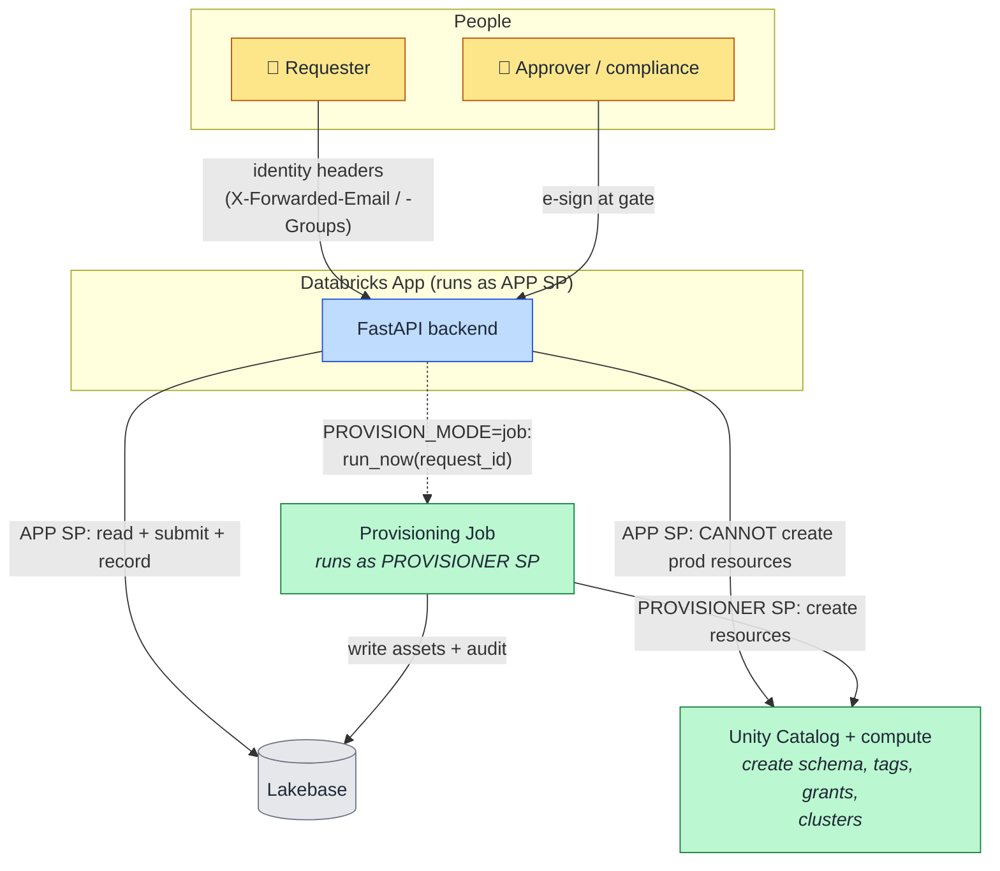

# 7. Identity & Separation of Duties (Flow)

Who authenticates as what, and why **submitting** a request is deliberately split from **creating**
resources. Separation of duties (SoD) is a hard requirement for regulated platform teams, and PAVE
models it with two service principals.

## How to read it

- **User identity** comes from Databricks Apps: the platform injects `X-Forwarded-Email` /
  `-Groups`, which `auth.get_current_user` reads. Role (requester / approver / admin) derives from
  group membership. There is no separate PAVE login.
- The **App SP** is the identity the running app uses. It can read state, submit requests, record
  audit — but on the hardened path it is **not** the identity that creates resources.
- The **Provisioner SP** is privileged and runs the **provisioning Job**. When `PROVISION_MODE=job`,
  the app SP merely *triggers* the job (`run_now`); the job — running as the provisioner SP — does
  the actual `CREATE`. Submit and create are therefore different identities.

## Key points

- **Two modes, one engine.** `inprocess` (default, demo) runs the saga inside the backend as the app
  SP; `job` (SoD-hardened, deployed) offloads creation to the provisioner SP. The saga code is the
  same ([04](04-provisioning-saga.md)).
- **Least privilege.** The app SP holds only submit/read grants; only the provisioner SP holds
  create grants. A compromise of the app cannot silently mint prod infrastructure.
- Locally, a **persona switcher** in the SPA sets the identity headers so one machine can demo
  requester → approver → compliance without separate logins.
