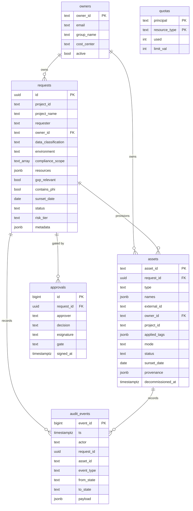

# 8. Data Model (ER)

PAVE's system of record. Operational state lives in **Lakebase (Postgres)** with an async pool;
the **`audit_events`** table is append-only immutable evidence. Together these replace per-request
IaC state files as the desired-state store.

## How to read it

- **`requests`** is the intake record (what was asked for, its classification, its risk tier, the
  resources as JSONB). The **`metadata`** jsonb column holds the expanded enterprise fields and the
  request's **`target_workspace`** (which workspace to provision into); `database._flatten` surfaces
  those keys to the top level on read, so providers see `request["target_workspace"]` uniformly.
  **`assets`** is one row per *provisioned* resource, carrying its `applied_tags`, `mode`
  (real/simulated), `external_id`, and lifecycle dates.
- **`owners`** is referenced by both requests and assets, so **ownership is by reference** — reassign
  the owner in one place and tags/attribution re-derive ([06](06-governance-tagging-finops.md)).
- **`approvals`** is one row per gate signature (with `esignature` + `gate`), so a Tier-2 request has
  multiple approval rows — the full sign-off chain.
- **`audit_events`** is the immutable spine: every state change, provision, and decommission is an
  append. Code only ever calls `add_audit` — never `UPDATE`/`DELETE` (ALCOA+).

## Key points

- **Operational vs evidence split.** Mutable app state → the operational tables; immutable evidence
  → `audit_events` (append-only). The record-as-code spec manifests are written into that audit log.
- `quotas` enforces per-principal caps per resource type at the gate.
- JSONB columns (`resources`, `applied_tags`, `names`, `payload`, `provenance`) store structured
  detail without a rigid schema, via a registered jsonb codec.
