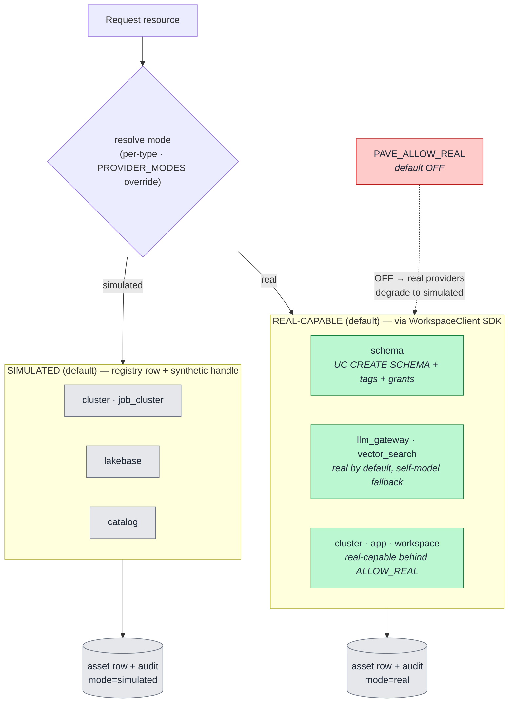

# 9. Hybrid Provisioning (Comparison)

PAVE is **SDK-primary** for every resource type, but runs in a **hybrid realism** mode: real for the
cheap/safe resources, simulated for the risky/costly ones — with a hard safety switch. This is the
honest picture of what actually mutates a workspace versus what is modeled.

## How to read it

- **Real (cheap/safe):** UC schema creation, governed-tag assignment, and grants run for real via
  the SDK — they are low-risk, low-cost, and reversible, so they demonstrate genuine governance.
- **Simulated (risky/costly):** clusters, job clusters, Lakebase, catalogs, AI endpoints, and
  workspaces are modeled as registry rows with synthetic handles — full lifecycle, tags, and audit,
  but **no real spend** and no dependence on elevated rights we may not have.
- **`PAVE_ALLOW_REAL` is the kill-switch.** It defaults **off**; with it off, even the "real"
  providers degrade to simulated. The deployed app sets it on. This exists because
  `WorkspaceClient()` authenticates from wherever it runs — without the guard, a local test would
  mutate the live workspace.

## Key points

- **Per-type configurability.** `PROVIDER_MODES` (JSON) overrides the mode per resource type, so a
  team can turn on exactly the real providers they are ready to validate.
- **Same downstream record either way** — an `asset` row + audit event is written whether real or
  simulated, only the `mode` differs. The governance story is identical.
- **Default modes** (`registry.DEFAULT_MODES`): `schema` real; `llm_gateway_endpoint` and
  `vector_search` **real-capable by default** (self-model when `ALLOW_REAL` is off); `cluster`,
  `app`, `workspace` real-capable behind the switch; `cluster`/`job_cluster`/`lakebase`/`catalog`
  simulated by default. Any type is flippable via `PROVIDER_MODES`.
- **Verified real against a live workspace/account:** UC schema (+ governed tags), and account-level
  **serverless workspace creation** with metastore assignment. Classic clusters need a non-serverless
  workspace to reach RUNNING; other real providers are exercised behind `ALLOW_REAL`.
