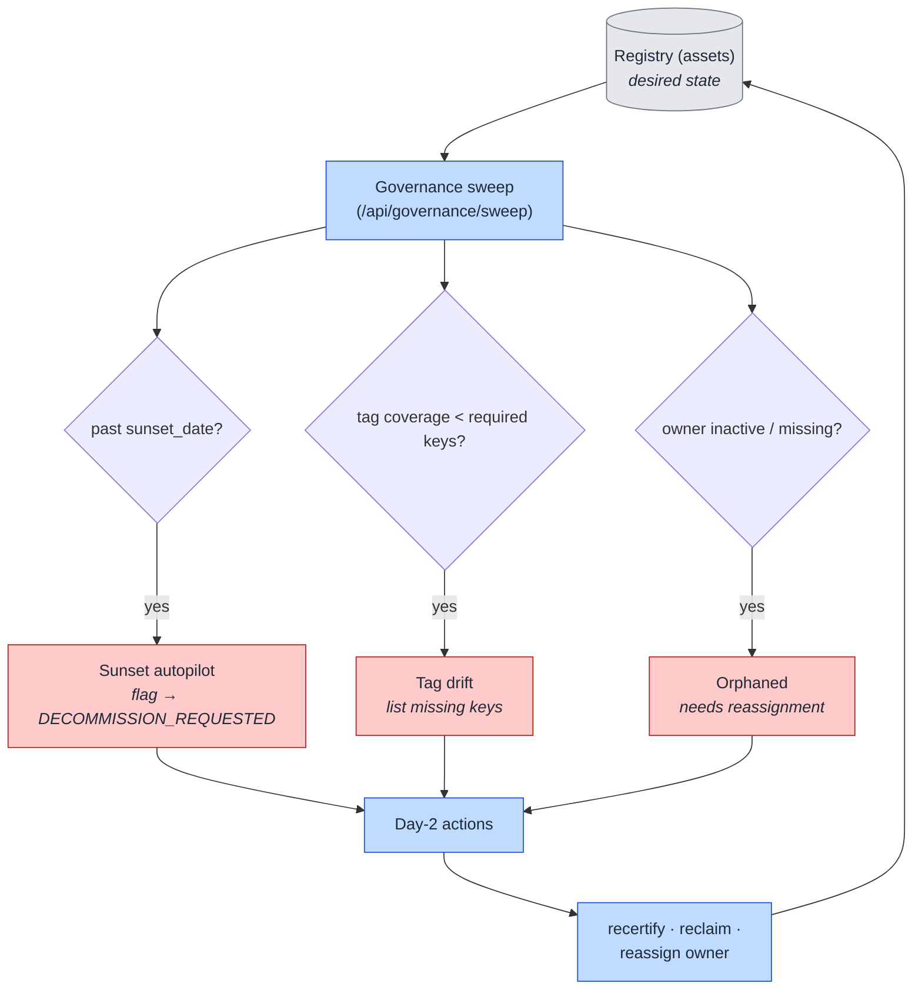

# 10. Reconcile & Drift Sweep (Flow)

How PAVE stays the source of truth *after* provisioning. Instead of per-resource IaC state, the
**registry is the desired state** and a **governance sweep is the reconcile loop** — the day-2
control plane (`/api/governance`).

## How to read it

- The sweep walks every registered asset and buckets the ones needing attention: **past sunset**,
  **tag drift** (applied tags no longer cover the required key set), and **orphaned** (owner inactive
  or gone). Everything else is reported as `clean`.
- Each finding routes to a day-2 action: the **sunset autopilot** moves aged resources toward
  `DECOMMISSION_REQUESTED`; drift can be re-tagged; orphans get reassigned (which re-derives tags via
  [06](06-governance-tagging-finops.md)); assets can be **recertified** or **reclaimed**.
- This is the reconcile loop: compare **desired state** (registry) to reality, surface the delta, and
  drive it back to compliant — the same idea as Terraform plan/apply, but continuous and
  registry-driven rather than file-driven.

## How to read it — industry pattern

Mirrors proven day-2 governance patterns: **TTL/sunset** (AWS AFT-style), **untagged-spend sweeps**
(FinOps), and **resource scorecards** (internal developer platforms). `managed_by = self-service-portal`
lets the sweep instantly separate PAVE-governed assets from hand-created ones.

## Key points

- **No IaC state to drift from** — the registry *is* the state, so reconcile needs no external state
  file per resource.
- **Recertification** gives a periodic "is this still needed / correctly owned" checkpoint, which is
  what regulated audits ask for.
- Sunset, drift, and orphan handling are the roadmap's "self-heal" surface; the sweep endpoint and
  recertify/reclaim actions exist today.
