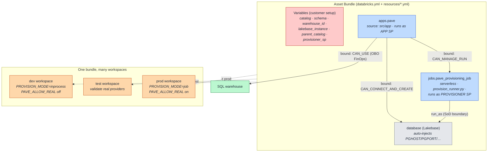

# 11. Deployment (DABs)

How **PAVE itself** is deployed. PAVE is shipped as a **Databricks Asset Bundle** — the app, the
provisioning Job, and the Lakebase database are declared once and deployed per environment. (Note
the distinction: DABs deploys *PAVE*; PAVE's *runtime* provisioning engine is the SDK, not a bundle
per request.)

## How to read it

- **One bundle, three resources.** The `apps.pave` app, the `pave_provisioning_job`, and the bound
  Lakebase `database` are declared together. The app's bound resources give it exactly the grants it
  needs: connect to Lakebase, use a warehouse for FinOps (on-behalf-of), and trigger the Job.
- **The Job carries the SoD boundary.** `run_as` the provisioner SP means the app can *start*
  provisioning but only the Job's privileged identity performs `CREATE` ([07](07-identity-sod.md)).
  The Job is serverless and its entrypoint is `provision_runner.py`, which calls the same
  `provisioning_service`.
- **All workspace-specific values are variables** — catalog, schema, warehouse, Lakebase instance,
  parent catalog, and the provisioner SP. Nothing workspace-specific is hard-coded, so the same
  bundle promotes across dev → test → prod by changing the target.

## Key points

- **Promotion model.** dev is the safe default (`inprocess`, kill-switch off); test is where the
  real providers get validated; prod runs the SoD Job path with `PAVE_ALLOW_REAL` on. This is the
  recommended multi-workspace setup for a regulated customer.
- **The bound `database` resource auto-injects `PG*` connection env** — never map those manually.
- **Two DABs flavors, by design:** this bundle deploys PAVE; a separate opt-in Python-DABs showcase
  demonstrates schema provisioning. Per-request Terraform/DABs is deliberately *not* used — the
  registry + reconcile sweep replace IaC state ([10](10-reconcile-drift.md)).
