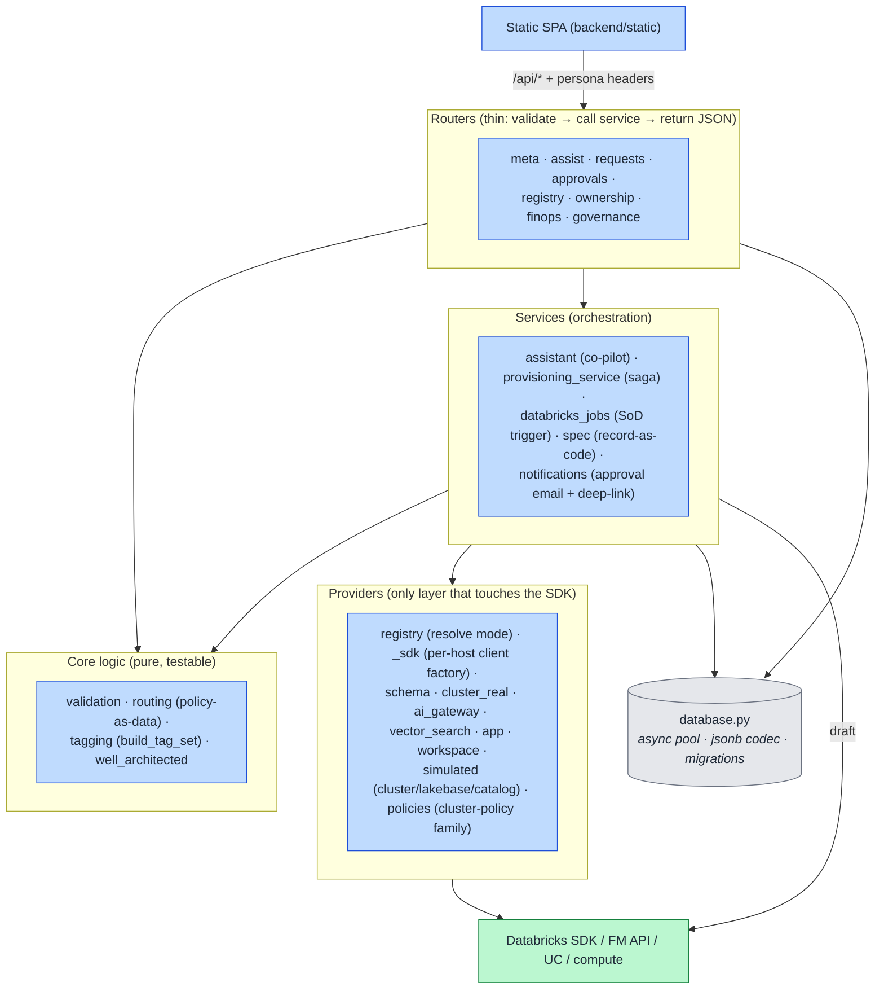

# 12. Backend Components (C4 Level 3)

Inside the FastAPI app: the modules and their responsibilities, and the one-way dependency flow.
This is "how the app is built" — the map a developer uses to find where a change goes.

## How to read it

- **Dependencies point one way:** routers → services → providers → SDK. Routers never call the SDK
  directly, and providers never import routers. That keeps each layer independently testable.
- **Routers are thin.** Each router (one per functional area) validates input, calls a service or a
  core function, and returns JSON. No business logic lives in a router (see `.claude/rules/api.md`).
- **Core is pure.** `validation`, `routing`, `tagging`, and `well_architected` are side-effect-free
  functions — they take a request and return a decision/tag set/score. That is why the governance
  model is auditable: the rules are data + pure functions, not scattered `if`s.
- **Providers are the only SDK boundary.** Everything that mutates a workspace is behind the provider
  interface ([14](14-provider-model.md)), so the safety switch and real/simulated modes have exactly
  one place to live.

## Key points

- **`database.py` is the single persistence gateway** — async pool, the jsonb codec (pass dicts, never
  `json.dumps`), and idempotent migrations all live there.
- The same **services** run whether provisioning is in-process or on the Job — the Job entrypoint
  (`provision_runner.py`) imports `provisioning_service` too ([07](07-identity-sod.md)).
- Adding a resource type = add a provider + register it; no router or core change needed.
