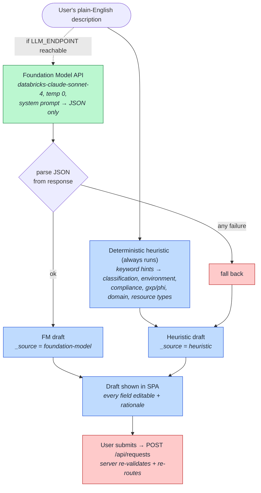

# 13. NL Intake Co-pilot (How plain English becomes a governed draft)

How `services/assistant.py` turns a sentence like *"a stage sandbox for an oncology RWE project that
touches PHI"* into a structured, pre-classified request draft — reliably, even offline.

## How to read it

- **The heuristic is the reliable core; the model is an enhancement.** The deterministic parser maps
  keywords to a full draft (classification, environment, compliance scope, gxp/phi flags, business
  domain, and a resource list). It *always* produces a valid draft, so the feature works offline and
  in demo mode.
- **The Foundation Model call refines it** when `LLM_ENDPOINT` is reachable: a temperature-0 call with
  a strict system prompt that must return JSON only. Any failure — endpoint down, bad JSON, timeout —
  is caught and silently falls back to the heuristic. `_source` records which path produced the draft.
- **Safety-relevant defaults are applied in the parse**, e.g. a `restricted` cluster is forced to
  `single-user` access mode before the human even sees it.
- **The draft is never trusted blindly.** It is a starting point the user edits; on submit the backend
  re-runs `validation` and `routing` server-side ([05](05-risk-tiered-routing.md)), so the co-pilot
  cannot talk a request past the gates.

## Key points

- **Deterministic > magical.** Classification and PHI/GxP detection default toward *more* restrictive,
  never less — a co-pilot that under-classifies is a compliance risk.
- The system prompt is written for a **regulated life-sciences** context: anything PHI/clinical/trial
  maps to `restricted` + the right compliance scope.
- The co-pilot only drafts; it never provisions. Everything downstream is the same governed path a
  hand-filled request takes.
