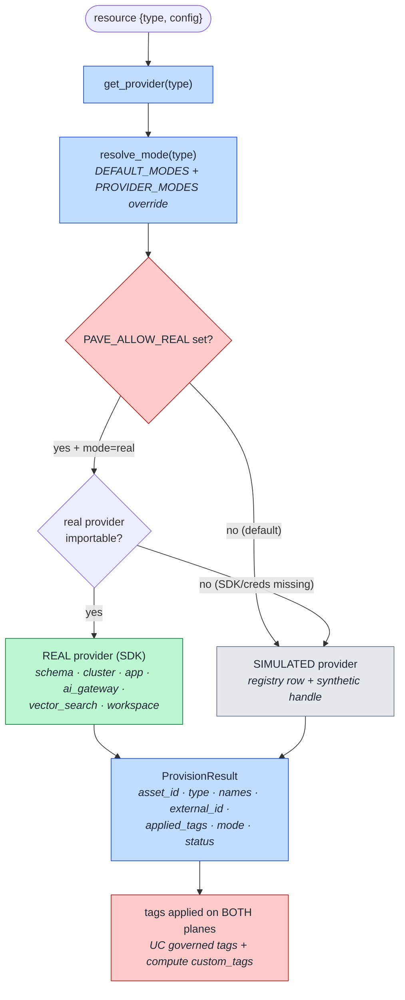

# 14. Provider Model (How one resource gets provisioned)

The saga calls a **provider** per resource. This view is the provider selection + execution
mechanism: how a resource type resolves to a real or simulated implementation, gated by the safety
switch, all behind one interface.

## How to read it

- Every provider implements the same tiny `Provider` protocol: `provision(request, resource, tag_set,
  context) → ProvisionResult` and `decommission(asset, context)`. The saga does not care whether the
  result came from a real SDK call or a simulation — same shape either way.
- **Mode resolution is data.** `DEFAULT_MODES` encodes the hybrid demo policy (schema real; cluster /
  job_cluster / lakebase / catalog / workspace simulated; AI real-capable). `PROVIDER_MODES` (JSON
  env) overrides per type, so a team flips exactly the providers they are ready to run for real.
- **The safety switch is the outer gate.** With `PAVE_ALLOW_REAL` unset (the default), even a
  `mode=real` type runs simulated — nothing mutates the workspace. Real providers are also imported
  **lazily**, so a missing SDK/credential degrades to simulated instead of crashing the app.
- Whichever path runs, the tag set (derived once by `build_tag_set`) is applied on **both** planes and
  the same `ProvisionResult` is written as an `asset` row ([06](06-governance-tagging-finops.md)).

## Key points

- **One interface, two realities.** This is what makes [09](09-hybrid-provisioning.md) possible
  without branching the saga.
- A third mode, **`dabs`**, exists for the opt-in Python-DABs schema showcase; like `real` it only runs
  behind `PAVE_ALLOW_REAL`.
- Adding a resource type is additive: implement the protocol, register the type in `DEFAULT_MODES`.
