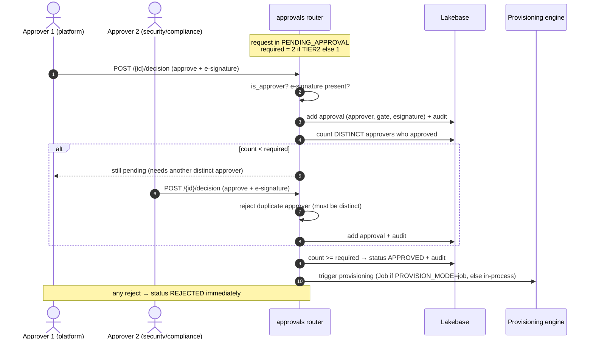

# 15. Approval & E-signature (How gates and dual approval work)

How `routers/approvals.py` enforces the right number of distinct, e-signed approvals before anything
is provisioned — and how the final approval hands off to the engine.

## How to read it

- **Required signatures come from the tier.** `_required_approvals` returns **2 for Tier 2**, **1
  otherwise**. Tier 2's two signatures must be **distinct approvers** — the same person approving
  twice is rejected, which is the enforced dual-control / separation-of-duties rule.
- **E-signature is mandatory.** A decision without a non-empty `esignature` is a validation error.
  Each signature is stored as its own `approvals` row with the `approver`, `gate`, and `esignature`,
  and mirrored into the append-only audit — that is the 21 CFR Part 11-style signed record.
- **The gate is derived from the approver's role** (admins sign the `security-compliance` gate,
  others the `platform` gate), so a Tier-2 request naturally accumulates a platform + compliance
  signature pair.
- **A single reject is terminal** — the request goes straight to `REJECTED`; it does not wait for the
  other gate.
- On the **final** approval the router triggers provisioning: it prefers the SoD Job path
  (`PROVISION_MODE=job`) and falls back to in-process if the job trigger fails
  ([07](07-identity-sod.md)).

## Key points

- **Distinct-approver enforcement** is the concrete mechanism behind "dual approval" — not just a
  count, but a count of *unique* identities.
- Every signature and state change is an append to `audit_events`; the approval chain is fully
  reconstructable ([08](08-data-model.md)).
