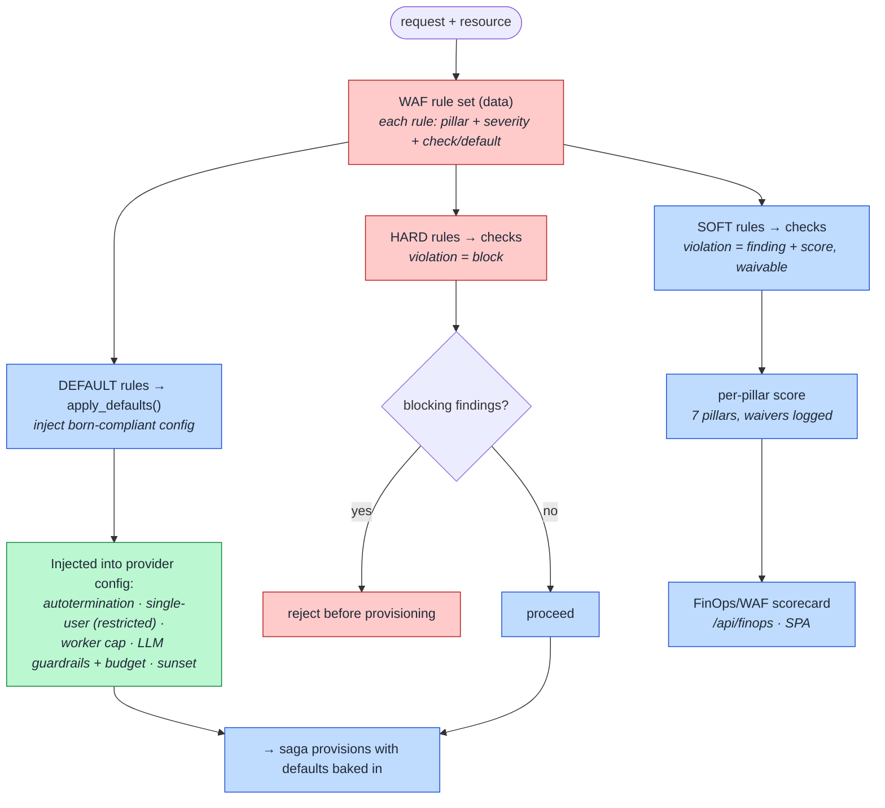

# 16. Well-Architected Enforcement (How born-compliant defaults + scoring work)

How `well_architected.py` turns the 7 Well-Architected Lakehouse pillars from an after-the-fact
scorecard into **provisioning-time enforcement** — injecting safe defaults, blocking violations, and
scoring the rest.

## How to read it

- **Rules are data.** Each `WafRule` carries a **pillar** (Governance, Cost, Security, Operational
  Excellence, Reliability, Performance, Interoperability), a **severity**, and either a `default`
  (inject) or a `check` (evaluate). The three severities do three different jobs:
  - **default** — `apply_defaults()` injects born-compliant config into the resource *before* the
    provider sees it: autotermination on compute, `single-user` access for restricted data, a worker
    cap, LLM PII/safety guardrails + budget cap, a sunset date.
  - **hard** — a violation that **blocks** (e.g. restricted data on shared compute). The request does
    not provision.
  - **soft** — a violation that **lowers a pillar score** and can be **waived** with a logged reason
    (e.g. no autotermination, missing backup owner, no budget cap).
- The scorecard is computed from these same rules against the real request — so the number a customer
  sees is genuine enforcement evidence, not a self-assessment.

## Key points

- **This is the "teaching tool" pillar of PAVE:** every resource is born already satisfying the
  defaults, and any gap is either blocked or an auditable, waived finding.
- The scope is deliberately **provisioning-time** controls only — runtime/consumer WAF items are out
  of scope for PAVE (it enforces what it can guarantee at birth).
- Waivers are recorded, so "we knowingly accepted this" is itself part of the audit trail.
