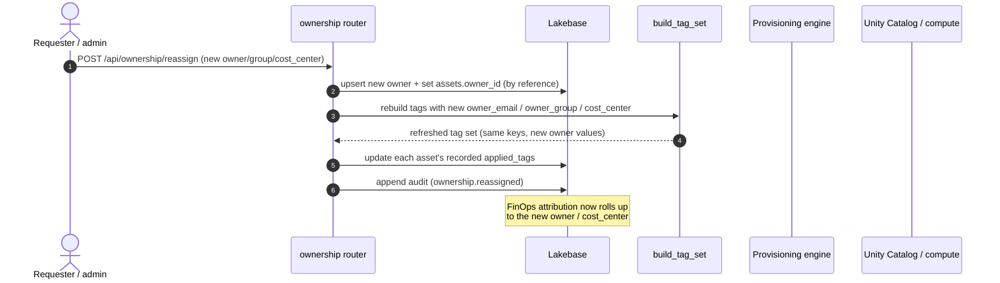

# 17. Ownership Reassignment (How tags follow the owner)

Ownership is **by reference** (`owner_id` FK), so reassigning a project's assets is a registry
update that **re-derives** the tag set — and the new attribution follows automatically. This view is
that mechanism.

## How to read it

- **One source of truth for owner.** Because assets reference an `owner_id` rather than copying owner
  fields, reassignment is a single FK update plus a tag refresh — there is no hunt-and-replace across
  resources.
- **Tags are re-derived, not hand-edited.** The same `build_tag_set` used at provisioning time is
  called again with the new owner's `owner_email` / `owner_group` / `cost_center`. The **keys stay
  identical**; only the owner-related values change, so the billing join keeps working
  ([06](06-governance-tagging-finops.md)).
- **The recorded tag set is updated** on each asset (`applied_tags`), so FinOps attribution and the
  registry immediately reflect the new owner. (Re-applying the derived tags onto the live UC
  securable via the SDK is a roadmap step; today reassignment updates PAVE's record of truth — the
  registry — which is what the FinOps join reads.)
- The reassignment is an **audited event**, so who moved what to whom, and when, is on the record.

## Key points

- **Attribution never goes stale on a team change** — the most common cause of "untagged spend" in
  the wild. When a person moves teams, PAVE re-points the assets and the cost rolls up correctly.
- This is why "portable ownership" is a headline capability: it is a first-class, audited operation,
  not a manual re-tag.
