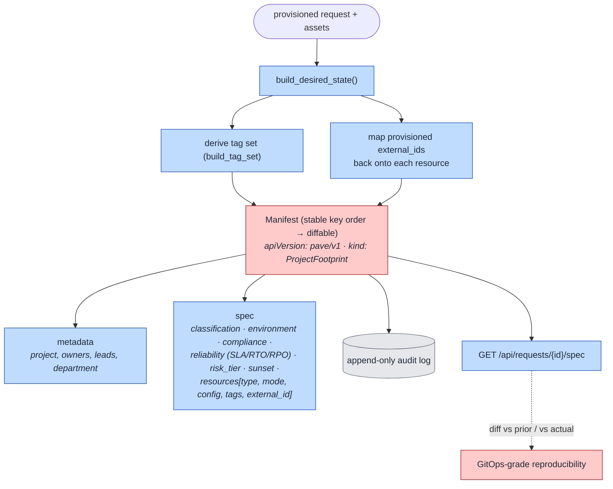

# 18. Record-as-Code Spec (How the declarative manifest is built)

PAVE **executes imperatively** (SDK, no per-request IaC state) but **records declaratively**: every
request emits a canonical, diffable manifest of its resolved desired state. This view is how
`services/spec.py` builds that manifest and where it lives.

> **Why SDK and not per-request IaC/DABs?** PAVE deploys *itself* with a YAML bundle, but
> provisions resources imperatively via the SDK and records desired state declaratively (this
> manifest) — GitOps-grade auditability without an IaC state file per request.

## How to read it

- **The manifest is the "code" record of a request** — a Kubernetes-style document (`apiVersion:
  pave/v1`, `kind: ProjectFootprint`) with a stable key order so two versions diff cleanly. It merges
  three things: the request's declared intent, the derived tag set, and the *actual* provisioned
  `external_id`s mapped back onto each resource.
- **It captures the full governance envelope**, not just resources: data classification, compliance
  (GxP / PHI / DPIA / retention), reliability targets (SLA / RTO / RPO), risk tier, and sunset date.
- **It is written to the append-only audit log** and retrievable via the API. So a platform or
  compliance team gets GitOps-style reproducibility and diffability — "show me exactly what this
  project's footprint was, and how it changed" — **without an IaC file per request**.

## Key points

- **Execute imperatively, record declaratively.** This is the design decision that lets PAVE use the
  SDK (fast, scales) while still giving regulated shops an auditable, diffable desired-state document.
- The manifest is the natural **diff source for the reconcile sweep** ([10](10-reconcile-drift.md)):
  desired state (manifest) vs actual (registry/workspace).
- Because it embeds the resolved tags and external ids, it doubles as evidence of *what was actually
  applied*, not just what was asked for.
