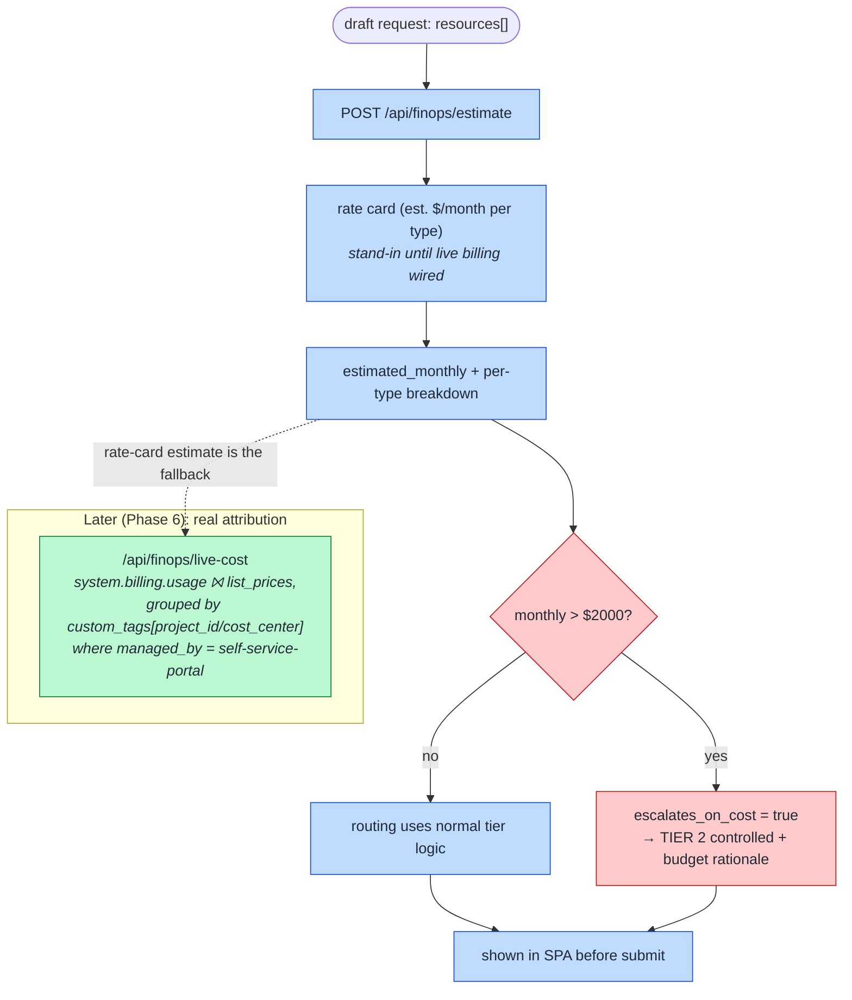

# 19. Cost Estimate & Budget Escalation (How cost shifts left into routing)

How PAVE previews cost **before** submit and lets a budget breach change the approval path — FinOps
shifted left to the moment of request, not discovered on next month's bill.

## How to read it

- **Estimate before submit.** `/api/finops/estimate` sums a per-resource-type rate card and returns
  `estimated_monthly` + a per-type breakdown, so the requester sees the cost while still editing the
  request — not after provisioning.
- **Cost can change the tier.** When the estimate exceeds the **$2000** threshold, `escalates_on_cost`
  is set and routing pulls the request up to **Tier 2 controlled** with a budget rationale
  ([05](05-risk-tiered-routing.md)). A cheap dev sandbox stays fast-lane; an expensive one earns a
  second look. This is the FinOps guardrail sitting inside the governance gate.
- **The rate card is a documented stand-in.** Until live billing is wired (Phase 6), cost is estimated
  from a simple rate card. The real path, `/api/finops/live-cost`, joins `system.billing.usage` to
  `list_prices` and groups by the `custom_tags` PAVE guarantees — falling back to the estimate when
  the warehouse/system tables are unreachable (e.g. local/demo).

## Key points

- **Same tag keys make live cost a drop-in.** Because provisioning already stamps `project_id`,
  `cost_center`, and `managed_by = self-service-portal` on both planes, the live query needs no new
  plumbing — it just groups by tags that are already there ([06](06-governance-tagging-finops.md)).
- **Attribution completeness, not cost charts.** PAVE quantifies how much spend is correctly
  attributed and flags budget breaches; it deep-links Databricks' native dashboards for the spend
  view itself.
